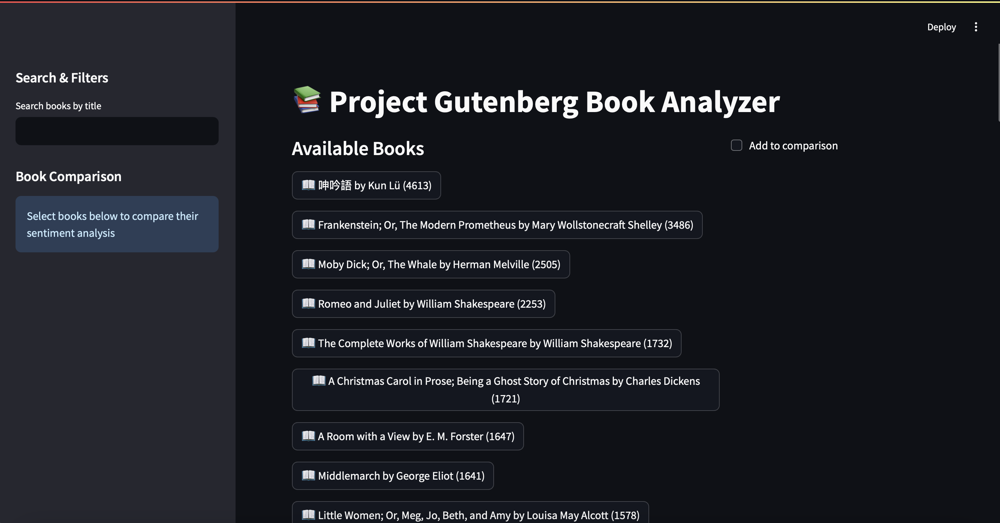

Welcome to Gutenberg Analyzer! Check it out [here](https://gutenberg-analyzer.streamlit.app).

This project scrapes the top 100 ebooks from the previous day, shows an excerpt from the book, and analyzes the polarity and subjectivity of the book, both overall...

...and throughout the text.

You can also compare multiple books at once...

...and search for a book (if it is in the top 100).

Known Errors:

1. Clicking "Clear Comparisons" causes an error that breaks the search field and then the entire site unless the search field is hidden and shown again and the "Add to comparisons" checkbox is unticked (comparisons and the rest of the site will then continue to function).
2. The "Author" and "Year" fields show 'Unknown'.
3. Books in languages other than English have no sentiment analysis.

Find more errors? Please create a PR!